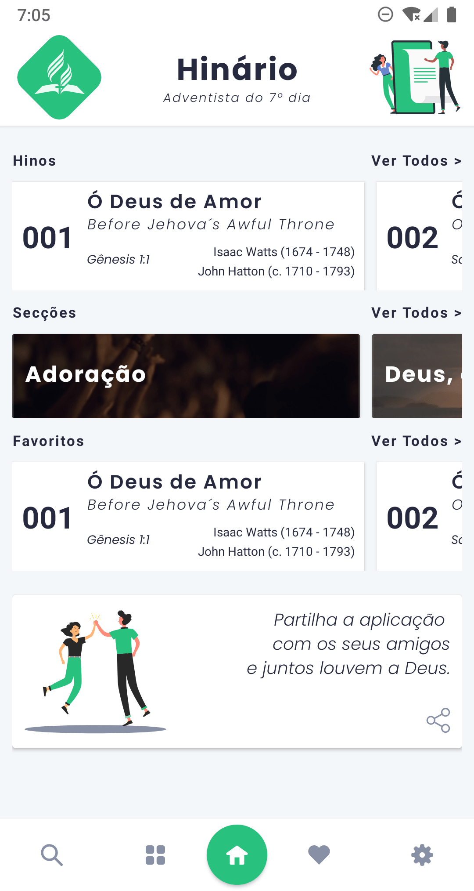
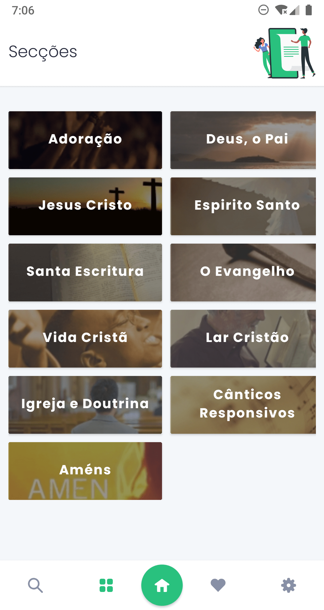
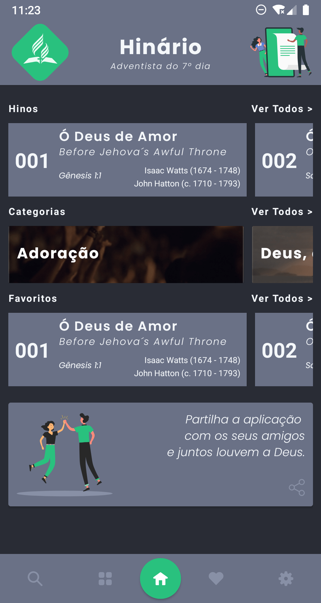
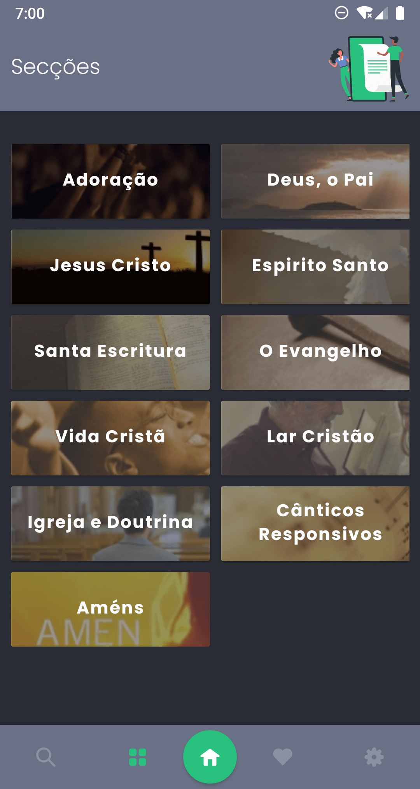

# `Hinário Adventista do 7º Dia`

Este projeto tras todos os `610 hinos` do `Hinário Adventista do 7º dia`, com os seus respetivos `autores`, `compositores` e `textos bíblicos`, de forma totalmente organizada e com uma interface totalmente simples e interativa como nunca se viu. Veja o site em [https://hinario-adventista.vercel.app/](https://hinario-adventista.vercel.app/)

    

 

## Telas do App

    
    
    
    

## Requisitos

Todos os requisitos aqui listados são indispensáveis para o desenvolvimento do projeto.

### Android

#### Ferramentas necessárias para a construção:

- Node 8.3
- npm
- Java SE Development Kit 8
- Android Studio
- Android SDK

## Api

Se quiser apenas utilizar o ficheiro `json` onde tem todos os `hinos` e as `Secções`, pode utilizar este link [https://raw.githubusercontent.com/moser-jose/Hina7/main/src/api/hinario.json](https://raw.githubusercontent.com/moser-jose/Hina7/main/src/api/hinario.json)

## Como contribuir

Para fazer um pull-request, primeiramente crie um fork do projeto para a sua conta, então clone o projeto em sua maquina:

`git clone https://github.com/moser-jose/Hina7.git`

usa o comando `npm install` para instalar todas as dependências do projeto.

Faça as alterações necessárias para a melhoria do projeto, não se esqueça de ser claro e informar o máximo de detalhes possíveis.

### Submetendo Pull Requests

- Crie pull requests pequenos, para que a revisão seja feita mais facilmente
- Inclua detalhes do que está sendo feito na descrição
- Altera a documentação se for necessário

## Changelog

- 1.0.7
  - Correções no hino 308 (adicionado a segunda estrofe). 📃
  - Correções na estrutura das subsecções. ✅📲
  - Retirado o botão Feedback. 👍🏻
  - Agora já se pesquisa pela letra do Hino. 🔍📃
  - Correção de alguns bugs. ⌨️

- 1.0.6

  - Correções na estrutura das subsecções. ✅📲
  - Mudanças na página das configurações. ⚙️
  - Agora já se pesquisa pela letra do Hino. 🔍📃
  - Adicionado o botão de limpar a caixa de pesquisa 🔍📃
  - Correções no hino 504. 📃
  - Correção de alguns bugs. ⌨️

- 1.0.5

  - Atualização dos Ícones do Hinário. ✅📲
  - Melhora no desempenho do App. 🧑🏾‍🚀
  - Adicionado o audio para todos os hinos. ▶️🎶
  - Precisa ter Internet para ouvir os áudios. ✅📲
  - Adicionado o hino 54. 📃
  - Adicionado o aumento da fonte dos hinos. 🔍
  - Atualização do cabeçalho dos hinos. 🌀📃

- 1.0.4

  - Performance nos hinos favoritos. 🧑🏻‍🚀
  - Atualização dos hinos nas secções. 🔰
  - Correção de alguns bugs. ⌨️

- 1.0.3

  - Performance na busca dos hinos. 🧑🏻‍🚀
  - Mudança do conteúdo da partilha do app 🌀
  - Mudança da página sobre. ⚙️
  - Correção de alguns bugs. ⌨️

- 1.0.2

  - Diminuição do tamanho do app. 🧲
  - Adicionado o hino 350. 📃
  - Correção de alguns bugs. ⌨️

- 1.0.1

  - Criação do projeto. 📱

## Licença

Este projeto é regido pela licença [MIT](/LICENSE.md).
Lembre-se apenas de ser uma pessoa legal e enviar de volta eventuais modificações, correções ou melhorias. ✌️

## Autor

| [ @moser-jose](https://github.com/moser-jose) |
| :----------------------------------------------------------------------------------------------------------------------------------: |

